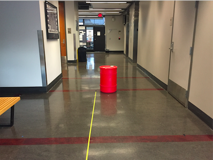
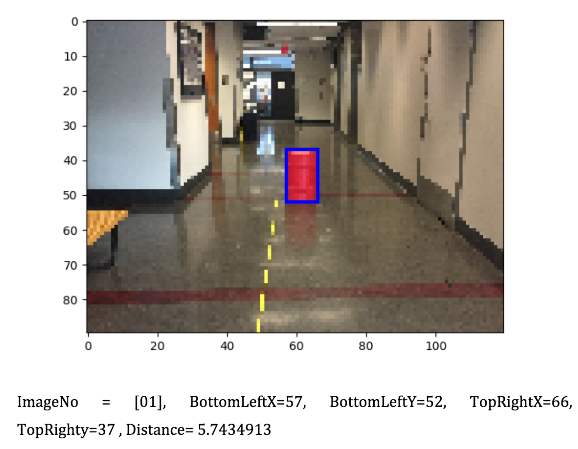

# Object-Detection-and-Color-Segmentation

  

In this project, I extract useful data of the red barrel and other colors’ from the given pictures by using roipoly function. The resulting information, which includes red barrel area, barrel distance, colors, and etc., generated a database for me to classify a testing picture. By using the database I got from previous training pictures, I trained a Gaussian Mixture Model (GMM) to find where the barrel is located and then I took out the red region by using Find Contour function. At last, I trained a linear regression model to approximate the barrel’s distance.

Here is the way to run the repository. I am using Python3.6 Opencv3.3

plot_ols.py is my linear regression function

my_brown.py my_red.py my_notbred.py my_notyellow are used to extract color data function

g_data includes gaussian mixture mean, covariance, probability, and segmentation picture algarithm

find_color includes myAlgorithm which is used to find the red region and draw bounding box etc.

my toplevel is my top level code which is used to test my code.

